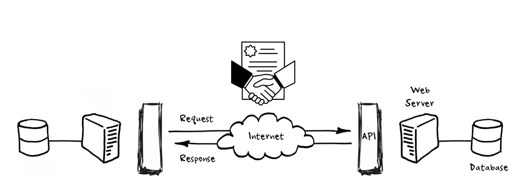

# A internet

Nos últimos anos, a Web se transformou de uma rede de servidores web que serviam principalmente páginas estáticas para navegadores de internet...


...em uma completa arquitetura cliente-servidor, onde aplicativos web utilizam princípios para se comunicar com aplicações do lado do servidor, cada vez mais por meio de APIs RESTful simples, mas poderosas.


# O que é uma API?

Uma API (Application Programming Interface) é um conjunto de rotinas e padrões (contratos) estabelecidos por uma aplicação, para que outras aplicações possam utilizar as funcionalidades dessa aplicação.


# As regras do jogo

Basicamente uma API é um contrato que define como uma aplicação vai se comunicar com a outra. Como os dados serão enviados e recebidos.



# O que é uma API REST?

REST é um acrônimo para REpresentational STATE Transfer, que é um estilo de arquitetura para sistemas distribuídos.


# Que ferramentas podemos usar em Python?

Temos muitas opções....


...mas vamos de FastAPI!

# Desenvolvendo nosso servidor

Vamos criar nosso contrato com Pydantic

```python
from pydantic import BaseModel

class Product(BaseModel):
    name: str
    price: float
    description: str
```

# Desenvolvendo nosso cliente

Como converar com ele?

- Nosso protocolo (ex: http)

- Nosso servidor tem um endereço (ex: localhost)

- Nosso servidor tem uma porta (ex: 8000)

- E precisamos acessar um recurso ou como constumamos chamar, endpoint ou rota (ex: /products)

``` 
http://localhost:8000/products
```

# Qual a diferença entre REST e RESTful?

REST é um estilo de arquitetura para sistemas distribuídos, enquanto RESTful é a implementação desse estilo.